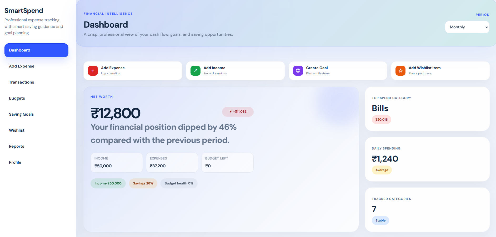

# SmartSpend

SmartSpend is a full-stack personal finance application for tracking income and expenses, planning budgets, monitoring savings goals, and evaluating wishlist purchases.

## Features

- JWT-based registration, login, and profile management
- Dashboard with balance, income, expense, savings, and budget summaries
- Transaction management with search, filtering, sorting, editing, and deletion
- Category budgets with usage tracking and overspending warnings
- Savings goals with progress tracking and monthly saving recommendations
- Spending-based saving suggestions
- Wishlist affordability and purchase recommendations
- Reports and charts built with Recharts
- Responsive interface with light, dark, and system themes

## Screenshots

| Home | Dashboard |
| --- | --- |
|  |  |

| Transactions | Add Expense |
| --- | --- |
|  |  |

| Saving Goal | Reports |
| --- | --- |
|  |  |

## Technology Stack

- Frontend: React 18, Vite, React Router, Axios, Recharts, jsPDF
- Backend: Node.js, Express, REST API, CORS
- Database: MongoDB with Mongoose
- Authentication: JSON Web Tokens and bcryptjs

## Project Structure

```text
.
├── backend/
│   ├── config/          # Database connection
│   ├── controllers/     # Request handlers
│   ├── middleware/      # Authentication and error handling
│   ├── models/          # Mongoose models
│   ├── routes/          # API routes
│   ├── services/        # Recommendation and suggestion logic
│   └── server.js        # Express entry point
├── frontend/
│   ├── src/components/  # Shared UI components
│   ├── src/context/     # Authentication and theme state
│   ├── src/pages/       # Application screens
│   └── src/services/    # API clients
├── Output/              # Application screenshots
├── DOCUMENTATION.md     # Extended technical documentation
└── package.json         # Root development scripts
```

## Getting Started

### Prerequisites

- Node.js 18 or later
- npm
- A MongoDB database, local or hosted through MongoDB Atlas

### 1. Install dependencies

From the project root:

```bash
npm run install-all
```

This installs dependencies in both `backend/` and `frontend/`.

### 2. Configure the backend

Create `backend/.env` using `backend/.env.example` as a template:

```env
MONGO_URI=mongodb+srv://<username>:<password>@cluster.example.mongodb.net/smartspend?retryWrites=true&w=majority
JWT_SECRET=replace_with_a_long_random_secret
PORT=5000
```

Do not commit `.env` or real credentials. They are excluded by `.gitignore`.

### 3. Start the application

From the project root, start both servers:

```bash
npm run dev
```

Then open [http://localhost:3000](http://localhost:3000). The backend API runs at `http://localhost:5000/api`.

To start either side separately:

```bash
# Backend
cd backend
npm run dev

# Frontend, in a second terminal
cd frontend
npm run dev
```

## Available Scripts

| Location | Command | Purpose |
| --- | --- | --- |
| Root | `npm run install-all` | Install backend and frontend dependencies |
| Root | `npm run dev` | Run backend and frontend together |
| Backend | `npm run dev` | Run the API with nodemon |
| Backend | `npm start` | Run the API with Node.js |
| Backend | `npm run normalize-dates` | Normalize stored transaction dates |
| Frontend | `npm run dev` | Start the Vite development server |
| Frontend | `npm run build` | Create a production build |
| Frontend | `npm run preview` | Preview the production build |

## API Overview

All API routes are served below `/api` and protected routes require a bearer token.

| Resource | Endpoints |
| --- | --- |
| Authentication | `POST /auth/register`, `POST /auth/login`, `GET /auth/profile`, `PUT /auth/profile` |
| Transactions | `GET`, `POST /transactions`; `PUT`, `DELETE /transactions/:id` |
| Dashboard | `GET /dashboard/summary`, `GET /dashboard/analytics` |
| Budgets | `GET`, `POST /budgets`; `PUT`, `DELETE /budgets/:id` |
| Suggestions | `GET /suggestions` |
| Goals | `GET`, `POST /goals`; `PUT`, `DELETE /goals/:id` |
| Wishlist | `GET`, `POST /wishlist`; `PUT`, `DELETE /wishlist/:id`; `GET /wishlist/:id/recommendation` |

## Future Improvements

- Bank synchronization and transaction imports
- Recurring payment reminders
- CSV export and import
- Multi-currency support
- Mobile application support

## License

This project is for educational and personal use. Add a license file before distributing it as open source.
